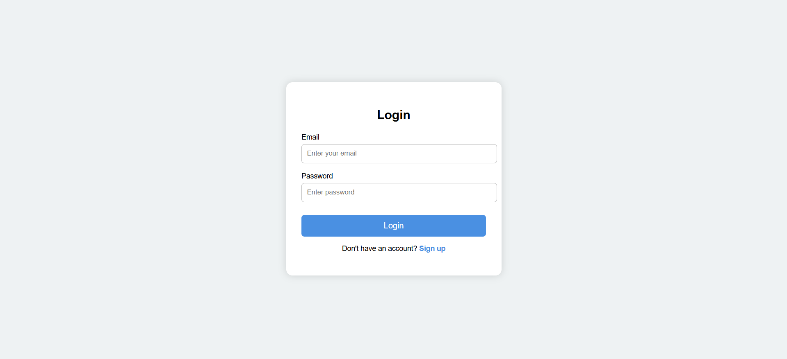
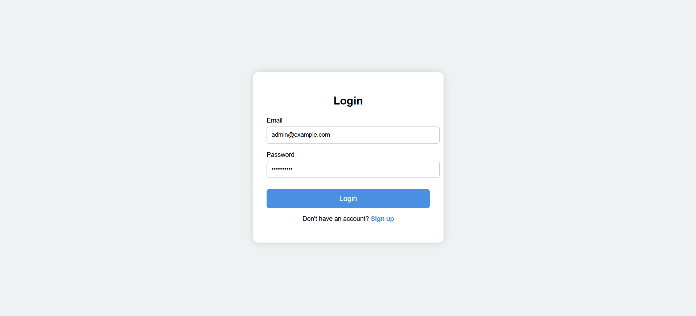
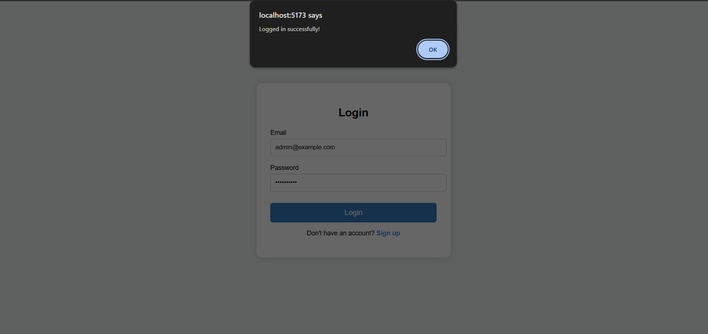
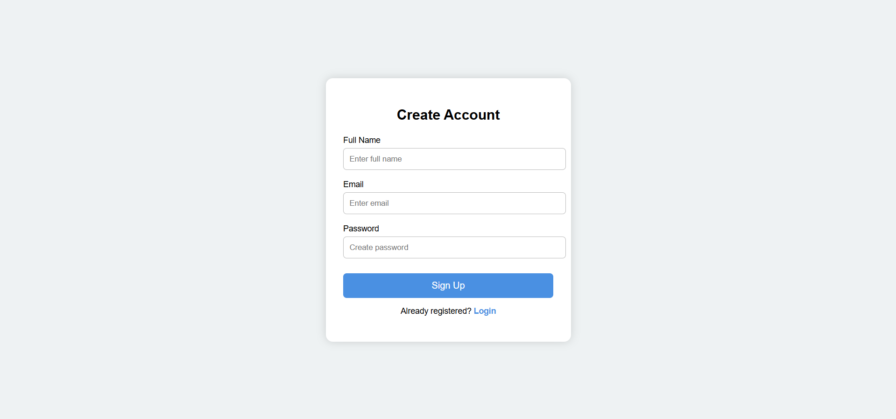
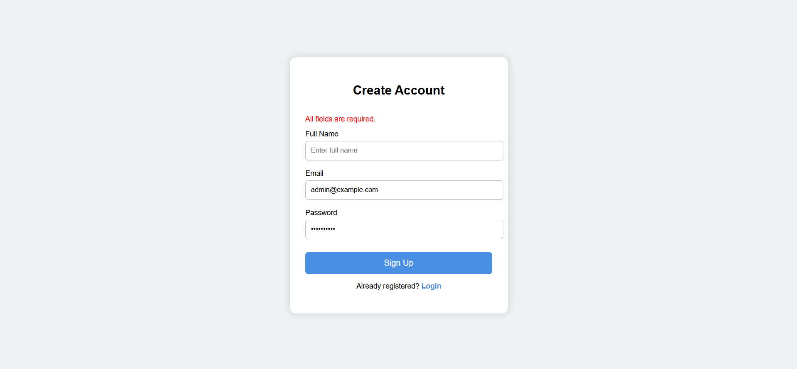
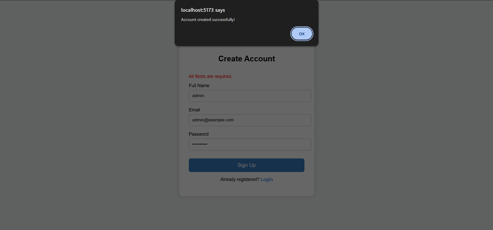

**Login Page**

**Enter Email and Password In Login page**

**Click on Login button**

**Signup page**

**Enter name, email and password in signup page**

**Click on sigup button**

## React Login/Signup Form

A simple and elegant **Login and Signup Form** built with **React** and **CSS** using **Vite**.  
This project demonstrates **controlled components**, **form validation**, and **conditional rendering**.

## Table of Contents

- [Demo](#demo)
- [Features](#features)
- [Technologies Used](#technologies-used)
- [Installation](#installation)
- [Usage](#usage)
- [Folder Structure](#folder-structure)
- [Components](#components)
- [Styling](#styling)
- [License](#license)

## Features

- Toggle between **Login** and **Signup** forms.
- **Controlled components** for handling form inputs.
- Form **validation**:
  - All fields required.
  - Password must be at least 6 characters for signup.
- Shows **error messages** dynamically.
- Smooth **fade-in animation** for the auth box.
- Clean and modern **UI** design.

## Technologies Used

- **React 18+** (Functional components & Hooks)
- **Vite** (Fast React setup)
- **CSS3**
- **JavaScript ES6+**

## Installation

Follow these steps to set up the project with **Vite**:

1.**Create a new Vite + React project**:
npm create vite@latest react-login-signup
Select the following options when prompted:

Project name: react-login-signup

Framework: React

Variant: JavaScript

Navigate to the project directory:

bash
Copy code
cd react-login-signup
Install dependencies:

bash
Copy code
npm install
Replace the contents of src/App.jsx and src/App.css with the Login/Signup form code.

Start the development server:

bash
Copy code
npm run dev
Open the browser at the URL shown in terminal (usually http://localhost:5173).

Usage
By default, the form opens in Login mode.

Click the Sign up link to switch to the Signup form.

Fill in the inputs and click the respective button.

Error messages appear if validation fails.

Alerts confirm successful login or signup (frontend-only).

**Folder Structure**

react-login-signup/
│
├─ public/
│   └─ index.html
│
├─ src/
│   ├─ App.jsx       
│   ├─ App.css           # Styling for the forms
|   ├─ LoginSignup.jsx   # Main component wit Login/Signup forms
│   └─ main.jsx          # React entry point
│
├─ package.json
└─ README.md

**Components**

App.jsx
- Handles the toggle state for Login/Signup forms.
- Renders the auth box with conditional content.

Login Component

- Controlled inputs for email and password.
- Handles onChange and onSubmit events.
- Displays error messages dynamically.

Signup Component
- Controlled inputs for name, email, and password.
- Validates all fields and ensures password length ≥ 6.
- Displays error messages below inputs.

**Styling (App.css)**
- .auth-wrapper: Centers the form vertically and horizontally.
- .auth-box: White card with shadow, padding, border-radius, and fade-in animation.
- input: Focus effect with blue border and shadow.
- .btn: Primary color with hover effect.
- .switch-text: Link to toggle forms.
- .error: Red text below inputs.